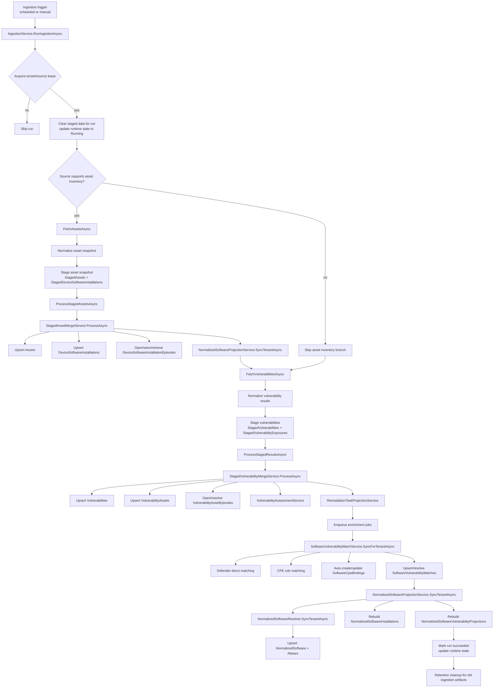
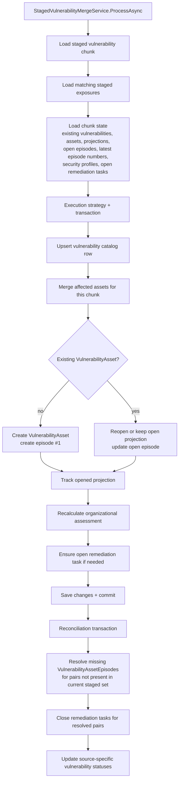
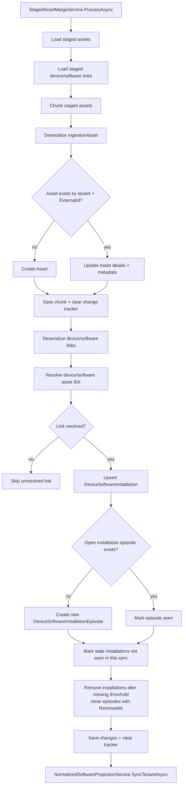
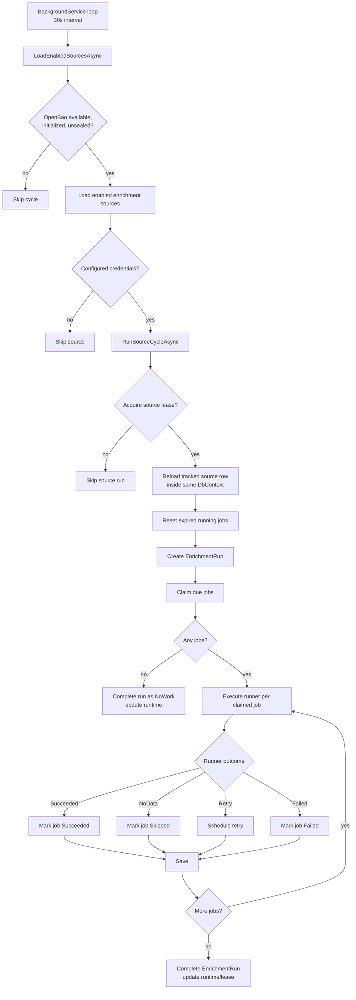

# Ingestion Flow

This document visualizes the current PatchHound ingestion and enrichment pipeline as implemented in:

- `src/PatchHound.Infrastructure/Services/IngestionService.cs`
- `src/PatchHound.Infrastructure/Services/StagedAssetMergeService.cs`
- `src/PatchHound.Infrastructure/Services/StagedVulnerabilityMergeService.cs`
- `src/PatchHound.Infrastructure/Services/SoftwareVulnerabilityMatchService.cs`
- `src/PatchHound.Infrastructure/Services/NormalizedSoftwareProjectionService.cs`
- `src/PatchHound.Worker/EnrichmentWorker.cs`

## High-Level Flow

## Vulnerability Merge Detail

## Asset Inventory Merge Detail

## Enrichment Worker Flow

## Notes

- Ingestion retries concurrency failures at the source-run level through `ExecuteWithConcurrencyRetryAsync(...)`.
- Asset inventory projection and normalized software projection are intentionally rebuilt deterministically per tenant in the current implementation.
- Software matching runs after vulnerability merge and enrichment enqueue, not before.
- Enrichment job execution is isolated from the ingestion transaction flow and runs through the worker.
- Normalized software detail/list APIs are served from the derived normalized tables, not by joining raw software assets on demand.
