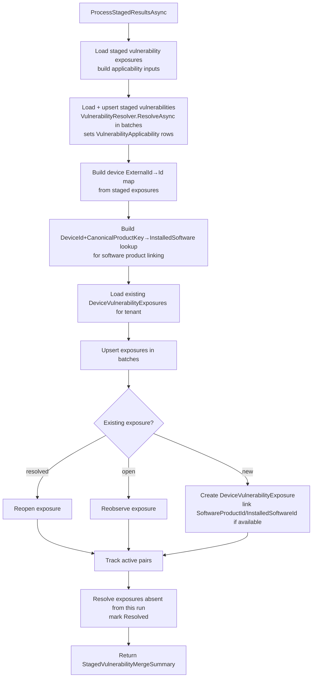
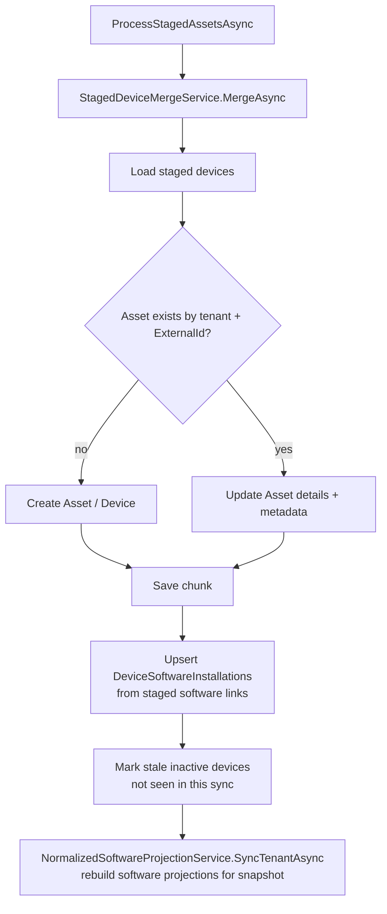
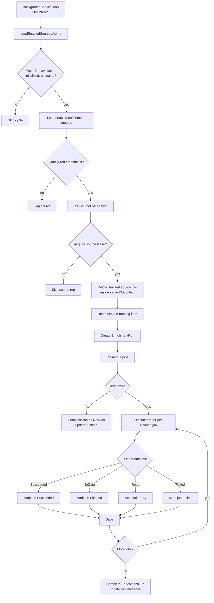

# Ingestion Flow

This document describes the current PatchHound ingestion and enrichment pipeline as implemented in:

- `src/PatchHound.Infrastructure/Services/IngestionService.cs`
- `src/PatchHound.Infrastructure/Services/StagedDeviceMergeService.cs`
- `src/PatchHound.Infrastructure/Services/ExposureDerivationService.cs`
- `src/PatchHound.Infrastructure/Services/ExposureEpisodeService.cs`
- `src/PatchHound.Infrastructure/Services/ExposureAssessmentService.cs`
- `src/PatchHound.Infrastructure/Services/NormalizedSoftwareProjectionService.cs`
- `src/PatchHound.Worker/EnrichmentWorker.cs`

## High-Level Flow

```mermaid
flowchart TD
    A[Ingestion trigger\nscheduled or manual] --> B[IngestionService.RunIngestionAsync]
    B --> C{Acquire tenant/source lease}
    C -- no --> Z1[Skip run]
    C -- yes --> D[RefreshDeviceActivityForTenantAsync\nmark devices inactive after 30 days]

    D --> E{Source supports software snapshots?\ne.g. Defender}
    E -- yes --> F[GetOrCreateBuildingSoftwareSnapshotAsync]
    E -- no --> G[Skip snapshot]

    F --> H{Asset staging checkpoint done?}
    G --> H

    H -- no, IAssetInventoryBatchSource --> I[StageAssetBatchesAsync\nbatch fetch from source]
    H -- no, IAssetInventorySource --> J[FetchAssetsAsync\nfull snapshot fetch]
    H -- yes, resumed --> K[Load staged asset counts]

    I --> L[ProcessStagedAssetsAsync\nStagedDeviceMergeService.MergeAsync]
    J --> M[StageAssetInventorySnapshotAsync] --> L
    K --> N[Asset merge checkpoint done?]
    N -- no --> L

    L --> O[CommitCheckpoint: asset-merge]
    O --> P{Vulnerability staging\ncheckpoint done?}

    P -- no, IVulnerabilityBatchSource --> Q[StageVulnerabilityBatchesAsync]
    P -- no, regular source --> R[FetchVulnerabilitiesAsync\nStageVulnerabilitiesAsync]
    P -- yes, resumed --> S[Load staged vuln count]

    Q --> T[ProcessStagedResultsAsync]
    R --> T
    S --> U[Vuln merge checkpoint done?]
    U -- no --> T

    T --> V[CommitCheckpoint: vulnerability-merge]
    V --> W[EnqueueEnrichmentJobsForRunAsync]
    W --> X[DeviceRuleEvaluationService.EvaluateRulesAsync]
    X --> Y[RunExposureDerivationAsync]

    Y --> Y1[ExposureDerivationService.DeriveForTenantAsync\nopen/reobserve/resolve DeviceVulnerabilityExposures\nbased on InstalledSoftware + VulnerabilityApplicabilities]
    Y1 --> Y2[SaveChanges]
    Y2 --> Y3[ExposureEpisodeService.SyncEpisodesForTenantAsync]
    Y3 --> Y4[SaveChanges]
    Y4 --> Y5[ExposureAssessmentService.AssessForTenantAsync]
    Y5 --> Y6[SaveChanges]
    Y6 --> Y7[RemediationCaseService.EnsureCasesForOpenExposuresAsync]

    Y7 --> Z{Software snapshot source?}
    Z -- yes --> AA[PublishSnapshotAsync\nNormalizedSoftwareProjectionService.SyncTenantAsync]
    AA --> AB[RemediationDecisionService\n.ReconcileResolvedSoftwareRemediationsAsync]
    Z -- no --> AB

    AB --> AC[ExposureAssessmentService.AssessForTenantAsync]
    AC --> AD[RiskScoreService.RecalculateForTenantAsync]
    AD --> AE[CompleteIngestionRunAsync\nmark Succeeded\nretention cleanup]
```

## Vulnerability Merge Detail (ProcessStagedResultsAsync)

`StagedVulnerabilityMergeService` was removed — this logic is now inlined as `IngestionService.ProcessStagedResultsAsync`.

## Asset Inventory Merge Detail (ProcessStagedAssetsAsync → StagedDeviceMergeService)

## Enrichment Worker Flow

## Notes

- Ingestion retries concurrency failures at the source-run level through `ExecuteWithConcurrencyRetryAsync`.
- Checkpointing (asset-staging, asset-merge, vulnerability-staging, vulnerability-merge) allows a run to resume at its last committed step rather than restart from scratch.
- `StagedVulnerabilityMergeService` was deleted (Phase 2 refactoring). Its logic now lives inline in `IngestionService.ProcessStagedResultsAsync`.
- Exposure derivation (`ExposureDerivationService`) works from `InstalledSoftware` + `VulnerabilityApplicabilities` — it replaces the old `SoftwareVulnerabilityMatchService` / `NormalizedSoftwareProjectionService` pipeline as the primary exposure computation path.
- `NormalizedSoftwareProjectionService.SyncTenantAsync` is still called for sources that maintain software snapshots (e.g. Defender) to keep normalized software tables up to date.
- Enrichment job execution is isolated from the ingestion transaction flow and runs through the worker.
- Device activity refresh marks devices inactive if `LastSeenAt` is older than 30 days. This runs before staging in each ingestion cycle.
