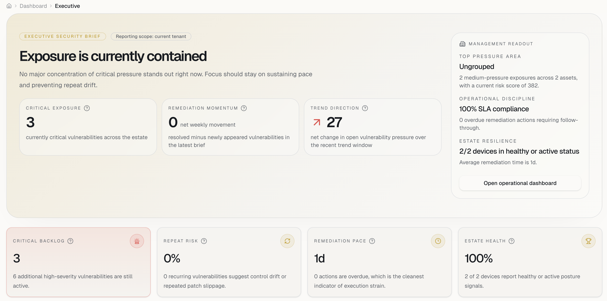
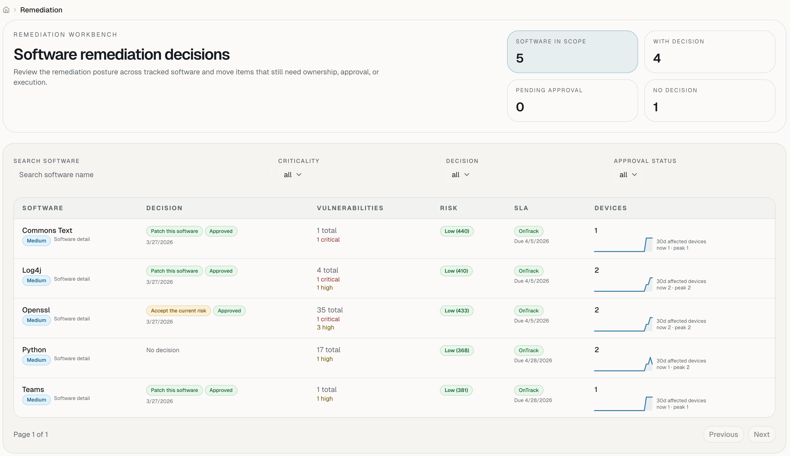
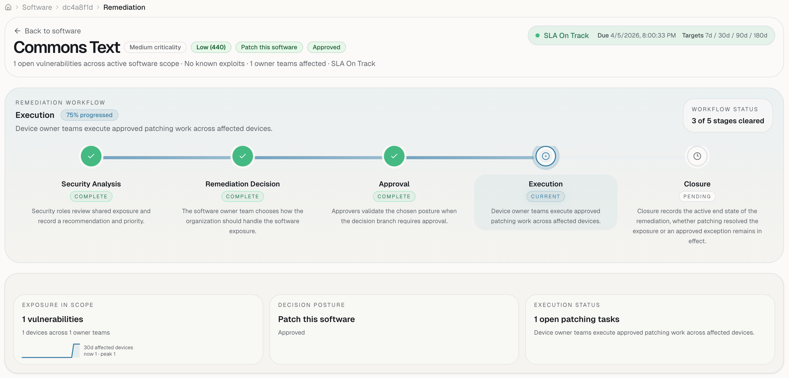

# PatchHound

PatchHound is a self-hosted vulnerability operations platform. It pulls security findings into one system, tracks remediation work, keeps an audit trail, and supports optional Microsoft Sentinel forwarding.

## What It Covers

- Vulnerability and asset ingestion
- Multi-tenant remediation workflows
- Risk scoring across assets, software, and tenants
- Audit logging and background processing
- ASP.NET Core backend with a React frontend

## Screenshots

**Executive dashboard**



**Remediation workbench**



**Remediation workflow**



## Stack

- Backend: .NET, ASP.NET Core, EF Core, SignalR
- Frontend: React, TanStack Start, Vite
- Database: PostgreSQL
- Secrets: OpenBao

## Quick Start

```bash
cp .env.example .env
docker compose up -d --build
```

Set the required values in `.env` before starting the stack. At minimum, local development needs:

- `POSTGRES_PASSWORD`
- `SESSION_SECRET`
- `AZURE_AD_CLIENT_ID`
- `AZURE_AD_AUDIENCE`
- `ENTRA_CLIENT_SECRET`

After startup:

- Frontend: `http://localhost:3000`
- API: `http://localhost:8080`

## Local Development

Backend:

```bash
dotnet build PatchHound.slnx
dotnet test PatchHound.slnx -v minimal
dotnet run --project src/PatchHound.Api
dotnet run --project src/PatchHound.Worker
```

Frontend:

```bash
cd frontend
npm install
npm run lint
npm run typecheck
npm test
npm run dev
```

## Documentation

- [Docs index](docs/README.md)
- [Getting started](docs/tutorials/getting-started.md)
- [Local development](docs/tutorials/local-development.md)
- [Create the Entra ID application](docs/tutorials/entra-id-application.md)
- [Create an ingestion source](docs/CREATE_INGESTION_SOURCE.md)
- [Adding an ingestion source](docs/tutorials/add-ingestion-source.md)
- [Risk score calculation](docs/risk-score-calculation.md)
- [Testing conventions](docs/testing-conventions.md)
- [Ingestion flow](INGESTION_FLOW.md)
- [Remediation flow](REMEDIATION_FLOW.md)
- [OpenBao deployment notes](deploy/openbao/README.md)

## Microsoft Sentinel Integration

To set up the Sentinel integration, first deploy the PatchHound data connector. Opening the link below will guide you through that deployment in Connector Studio.

[](https://connector-studio.reothor.no/?project=https://raw.githubusercontent.com/FrodeHus/PatchHound/refs/heads/main/PatchHound-project.json)

## OpenBao Policy

PatchHound expects a KV v2 mount named `patchhound` and an application token with access to the full application data path:

```hcl
path "patchhound/*" {
  capabilities = ["create", "update", "read"]
}
```

Set the resulting token in `.env` as `OPENBAO_TOKEN`.

## Contributing

See [CONTRIBUTING.md](CONTRIBUTING.md).

## Security

See [SECURITY.md](SECURITY.md).

## License

Licensed under [MIT](LICENSE).
