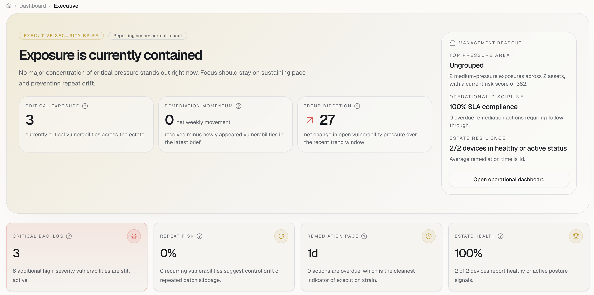
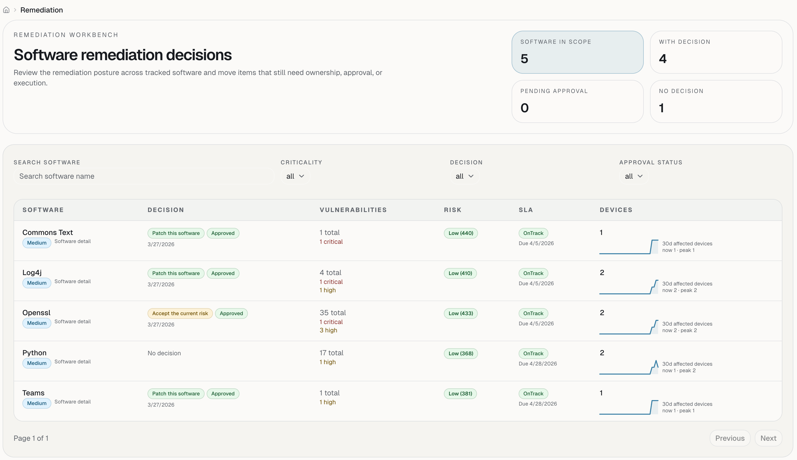
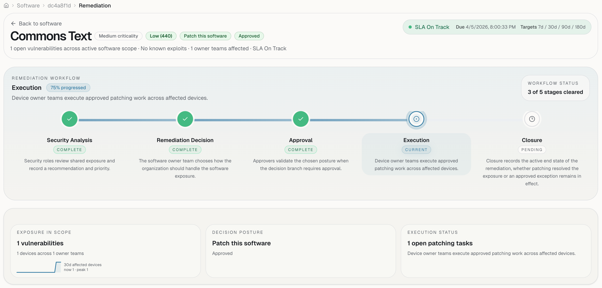
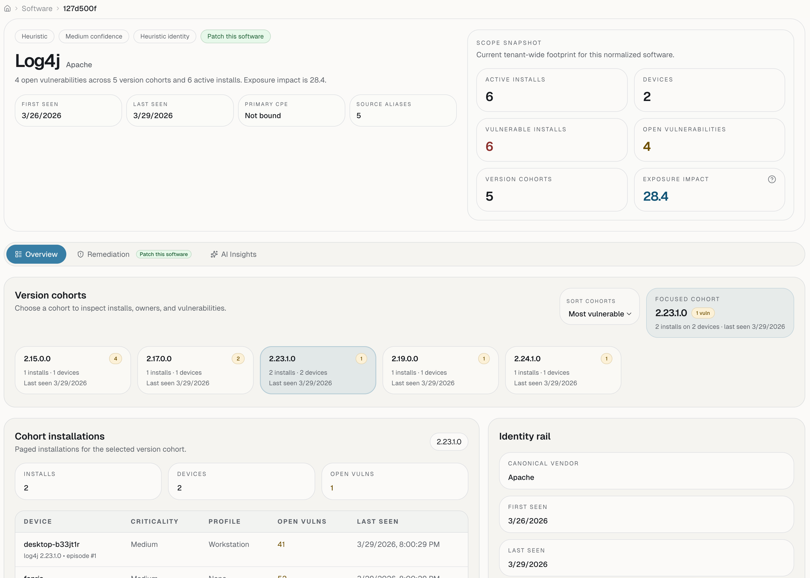
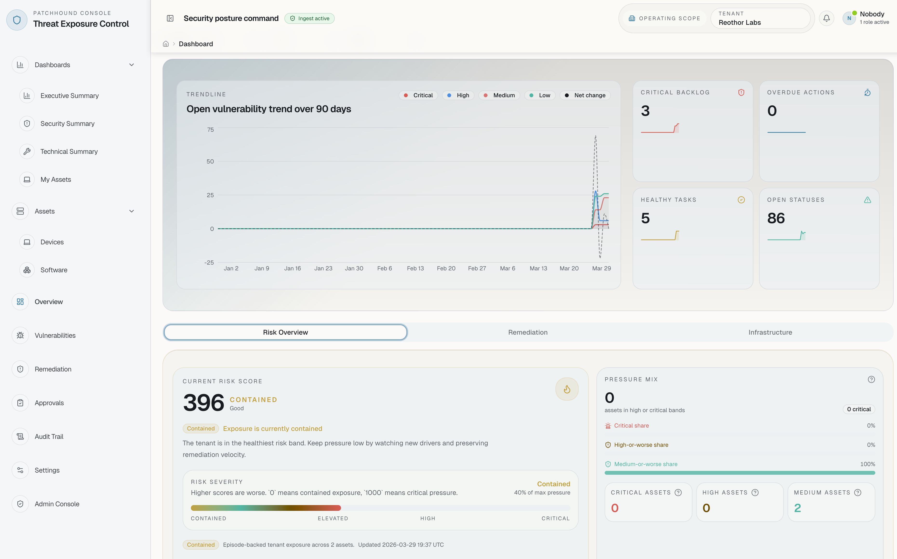

# PatchHound

PatchHound is a self-hosted vulnerability operations platform for turning security findings into tracked remediation work. It ingests vulnerability and asset data, normalizes software exposure, prioritizes risk across tenants, supports AI-assisted vulnerability assessments, and keeps an auditable workflow from detection through closure.

## Features

- **Vulnerability and asset ingestion** from tenant-configured sources, with checkpointed runs, staged merges, device activity refresh, and enrichment jobs.
- **Authenticated scan runner support** for collecting host-level software evidence through the `PatchHound.Puppy` runner and folding those results into the same inventory and exposure model.
- **Canonical software exposure modeling** that links installed software, vulnerability applicability, affected devices, version cohorts, and remediation cases.
- **Risk scoring** across vulnerabilities, devices, software, remediation cases, teams, and tenants, including threat and exposure signals such as CVSS, EPSS, exploit indicators, device criticality, and remediation posture.
- **AI-supported vulnerability assessments** that evaluate patch urgency, recommend emergency or normal patching timelines, capture confidence and rationale, list similar vulnerabilities, suggest compensating controls, and preserve references for analyst review.
- **Emergency patch workflows** that surface AI assessment results in remediation context, apply urgency-aware risk floors, and notify security and technical managers when immediate action is required.
- **Multi-tenant remediation workflows** with stage ownership, approvals, recurrence handling, patching tasks, risk acceptance, alternate mitigation, and auto-closure when exposure is resolved.
- **Executive and operational dashboards** for tenant risk, new and resolved vulnerabilities, aging, software exposure, remediation status, and risk-change summaries.
- **Audit and notification pipeline** with optional Microsoft Sentinel forwarding through the Logs Ingestion API.
- **Secret-backed operations** using OpenBao for source credentials, AI provider configuration, notification delivery secrets, and scan credentials.

## Screenshots

**Executive dashboard**



**Remediation workbench**



**Remediation workflow**



**Software exposure**



**Operations dashboard**



## Stack

- Backend: .NET, ASP.NET Core, EF Core, SignalR
- Worker: .NET background services for ingestion, enrichment, vulnerability assessment, SLA checks, workflows, authenticated scans, and NVD synchronization
- Runner: `PatchHound.Puppy` for tenant-side authenticated scanning
- Frontend: React 19, TanStack Start/Router, TanStack Query, Vite, Radix UI, Tailwind CSS
- Database: PostgreSQL
- Identity: Microsoft Entra ID
- Secrets: OpenBao KV v2
- Integrations: Microsoft Defender-style ingestion sources, NVD enrichment, AI providers, Microsoft Sentinel forwarding

## Quick Start

```bash
cp .env.example .env
docker compose up -d --build
```

Set the required values in `.env` before starting the stack. At minimum, local development needs:

- `POSTGRES_PASSWORD`
- `SESSION_SECRET`
- `AZURE_AD_CLIENT_ID`
- `AZURE_AD_AUDIENCE`
- `ENTRA_CLIENT_SECRET`

After startup:

- Frontend: `http://localhost:3000`
- API: `http://localhost:8080`

## Local Development

Backend:

```bash
dotnet build PatchHound.slnx
dotnet test PatchHound.slnx -v minimal
dotnet run --project src/PatchHound.Api
dotnet run --project src/PatchHound.Worker
```

Runner:

```bash
dotnet run --project src/PatchHound.Puppy
```

Frontend:

```bash
cd frontend
npm install
npm run lint
npm run typecheck
npm test
npm run dev
```

## Documentation

- [Docs index](docs/README.md)
- [Getting started](docs/tutorials/getting-started.md)
- [Local development](docs/tutorials/local-development.md)
- [Create the Entra ID application](docs/tutorials/entra-id-application.md)
- [Setting up an AI profile](SETTING_UP_AI_PROFILE.md)
- [Create an ingestion source](docs/CREATE_INGESTION_SOURCE.md)
- [Adding an ingestion source](docs/tutorials/add-ingestion-source.md)
- [Risk score calculation](docs/risk-score-calculation.md)
- [Scoring model reference](docs/SCORING.md)
- [Database diagram](docs/database-diagram.md)
- [Testing conventions](docs/testing-conventions.md)
- [Ingestion flow](INGESTION_FLOW.md)
- [Remediation flow](REMEDIATION_FLOW.md)
- [OpenBao deployment notes](deploy/openbao/README.md)

## Microsoft Sentinel Integration

To set up the Sentinel integration, first deploy the PatchHound data connector. Opening the link below will guide you through that deployment in Connector Studio.

[](https://connector-studio.reothor.no/?project=https://raw.githubusercontent.com/FrodeHus/PatchHound/refs/heads/main/PatchHound-project.json)

## OpenBao Policy

PatchHound expects a KV v2 mount named `patchhound` and an application token with access to the full application data path:

```hcl
path "patchhound/*" {
  capabilities = ["create", "update", "read", "delete"]
}
```

Set the resulting token in `.env` as `OPENBAO_TOKEN`.

## Contributing

See [CONTRIBUTING.md](CONTRIBUTING.md).

## Security

See [SECURITY.md](SECURITY.md).

## License

Licensed under [MIT](LICENSE).
