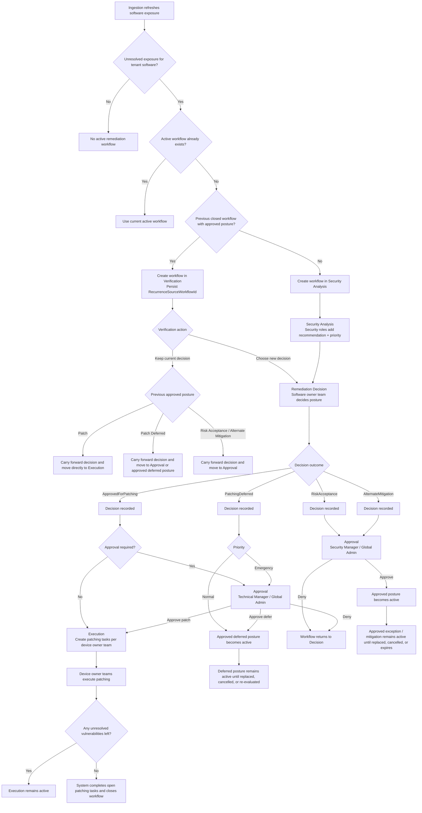
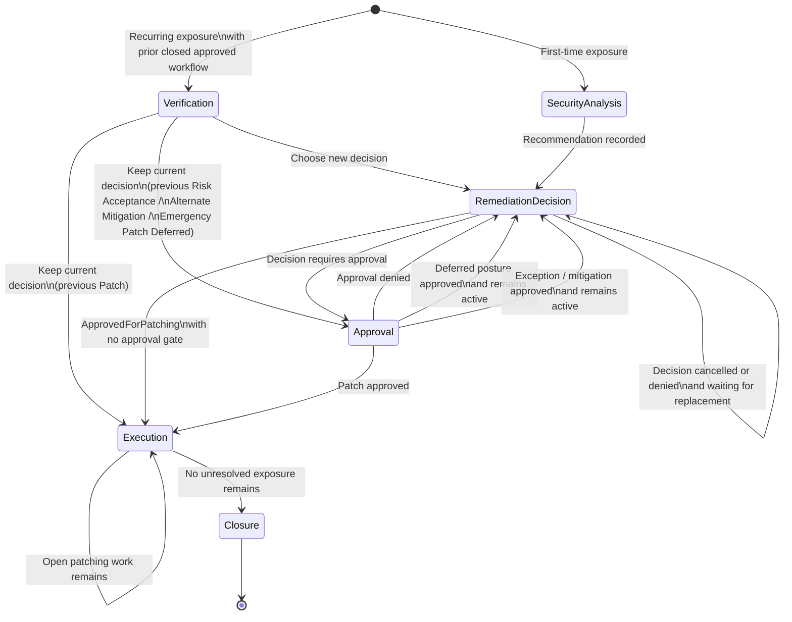
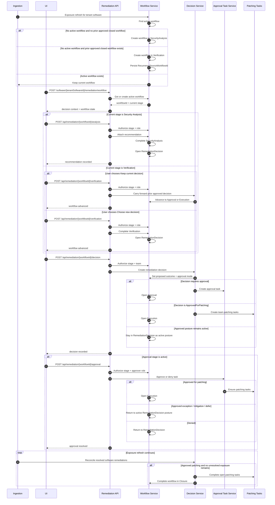

# Remediation Flow

This document reflects the remediation workflow as it is implemented today in PatchHound.

## Table of Contents

- [At a Glance](#at-a-glance)
- [How to Read This Document](#how-to-read-this-document)
- [Core Concepts](#core-concepts)
- [Workflow Bootstrap and Progression](#workflow-bootstrap-and-progression)
- [Workflow Stages](#workflow-stages)
- [Stage Ownership](#stage-ownership)
- [Decision Outcomes](#decision-outcomes)
- [Recurrence](#recurrence)
- [Auto-close](#auto-close)
- [Diagrams](#diagrams)
  - [Overview Flowchart](#overview-flowchart)
  - [Workflow State Diagram](#workflow-state-diagram)
  - [Sequence Diagram](#sequence-diagram)
- [History and Audit Trail](#history-and-audit-trail)
- [Current Implementation Notes](#current-implementation-notes)

## At a Glance

- Remediation is scoped to `TenantSoftwareId`.
- A persisted `RemediationWorkflow` is the source of truth for stage, ownership, and progression.
- `Exposure` is shared evidence, not a workflow stage.
- First-time exposure starts in `Security Analysis`.
- Recurring exposure starts in `Verification` only when there is a prior closed workflow with an approved posture.
- Workflow writes are stage-specific and workflow-scoped under `/api/remediation/{workflowId}/...`.
- A software-scoped bootstrap endpoint creates or resolves the active workflow: `POST /api/software/{tenantSoftwareId}/remediation/workflow`.
- `ApprovedForPatching` can move into `Execution`; `RiskAcceptance` and `AlternateMitigation` require approval; normal-priority `PatchingDeferred` auto-approves.
- For approved patching, the system auto-closes the workflow when no unresolved exposure remains.

## How to Read This Document

- `Core Concepts` explains the stable design rules behind the workflow.
- `Workflow Stages` explains what each stage means.
- `Stage Ownership` explains who is allowed to act at each stage.
- `Decision Outcomes` explains how the chosen posture changes the path.
- `Diagrams` gives three complementary views:
  - the overall business flow
  - the persisted workflow states
  - the runtime interaction between UI, API, and services

## Core Concepts

### Shared Context

Everyone involved in remediation sees the same software-wide exposure context:

- software identity
- vulnerability pressure
- affected devices
- version cohorts
- owner-team scope
- audit history

This is the `Exposure` view in the UI. It supports every stage, but it does not itself advance the workflow.

### Persisted Workflow Model

The backend stores one active remediation workflow per `TenantSoftwareId`.

Key points:

- first-time exposure creates a workflow in `SecurityAnalysis`
- recurrence creates a new workflow episode in `Verification`
- recurrence lineage is persisted on the new workflow via `RecurrenceSourceWorkflowId`
- historical workflows remain intact for audit and reporting

## Workflow Bootstrap and Progression

### Workflow bootstrap

The UI resolves or creates the active workflow explicitly through:

- `POST /api/software/{tenantSoftwareId}/remediation/workflow`

All stage actions then target workflow-scoped routes:

- `POST /api/remediation/{workflowId}/analysis`
- `POST /api/remediation/{workflowId}/verification`
- `POST /api/remediation/{workflowId}/decision`
- `POST /api/remediation/{workflowId}/approval`
- `POST /api/remediation/{workflowId}/decision/{decisionId}/cancel`

### Server-side enforcement

The backend verifies:

- the current workflow stage
- required prior-stage completion
- role or team membership for the current actor
- approval-mode rules for the chosen decision

Users without permission can still view the workflow, but they get a read-only view of the current stage.

## Workflow Stages

Current stages:

1. `Verification`
2. `SecurityAnalysis`
3. `RemediationDecision`
4. `Approval`
5. `Execution`
6. `Closure`

`Verification` only appears for recurrence. It is hidden for first-time exposure.

## Stage Ownership

### Security Analysis

Roles:

- `GlobalAdmin`
- `SecurityManager`
- `SecurityAnalyst`

Output:

- recommendation
- priority (`Emergency` / `Normal`)

### Verification

Shown only for recurrence.

Owner depends on the previous approved posture:

- previous `Patch` / `Patch Deferred`: software owner team
- previous `Risk Acceptance` / `Alternate Mitigation`: `SecurityManager` / `GlobalAdmin`

Actions:

- `Keep current decision`
- `Choose a new decision`

Behavior:

- keeping previous `Patch` goes straight to `Execution`
- keeping previous `Risk Acceptance` / `Alternate Mitigation` goes back through `Approval`
- choosing a new decision moves to `Remediation Decision`

### Remediation Decision

Owner:

- software owner team
- fallback: `Infrastructure`

Rule:

- any user in the assigned software owner team can complete the stage
- first valid submission wins

Output:

- final remediation decision
- justification

### Approval

Branching is decision-specific:

- `RiskAcceptance` / `AlternateMitigation`
  - roles: `GlobalAdmin`, `SecurityManager`
- `ApprovedForPatching`
  - roles: `GlobalAdmin`, `TechnicalManager`
- `PatchingDeferred`
  - `Normal` priority: auto-approved
  - `Emergency` priority: `GlobalAdmin`, `TechnicalManager`

### Execution

Only applies to approved patching.

Owners:

- device owner teams
- fallback: `Infrastructure`

This may be the same team as the software owner team, but it does not have to be.

### Closure

System-driven for resolved patching workflows.

For approved `RiskAcceptance`, `AlternateMitigation`, and deferred postures, the workflow remains in its active decision state rather than moving to `Closure`.

## Decision Outcomes

### `ApprovedForPatching`

- may require technical approval depending on workflow state
- creates patching tasks for device owner teams
- moves into `Execution`

### `PatchingDeferred`

- normal priority: active deferred posture without approval
- emergency priority: requires technical approval
- does not create patching tasks immediately

### `RiskAcceptance`

- requires security approval
- remains an active approved posture after approval

### `AlternateMitigation`

- requires security approval
- remains an active approved posture after approval

## Recurrence

When software exposure returns after a previous workflow was closed:

- a new workflow episode is created
- the new workflow stores `RecurrenceSourceWorkflowId`
- `Verification` asks whether the previous decision still applies

This preserves lineage while keeping recurrence separate from the old closed workflow.

## Auto-close

For approved patching:

- ingestion refreshes exposure
- if the tenant software no longer has unresolved vulnerabilities
- the system completes open patching tasks
- the workflow closes

This keeps execution state aligned with the actual software exposure.

## Diagrams

### Overview Flowchart

### Workflow State Diagram

### Sequence Diagram

## History and Audit Trail

The remediation history view combines:

- analyst recommendations
- workflow verification events
- remediation decision changes
- approval outcomes
- execution and closure events

Verification events are semantic, for example:

- `Verification opened`
- `Kept current decision`
- `Chose new decision`

## Current Implementation Notes

- remediation is software-wide, not per version cohort
- software owner team decides the remediation posture
- device owner teams execute approved patching
- fallback ownership is `Infrastructure`
- email delivery is best-effort and must not block remediation progression
- old software-scoped write shims have been retired in favor of explicit workflow bootstrap plus stage-specific workflow routes
