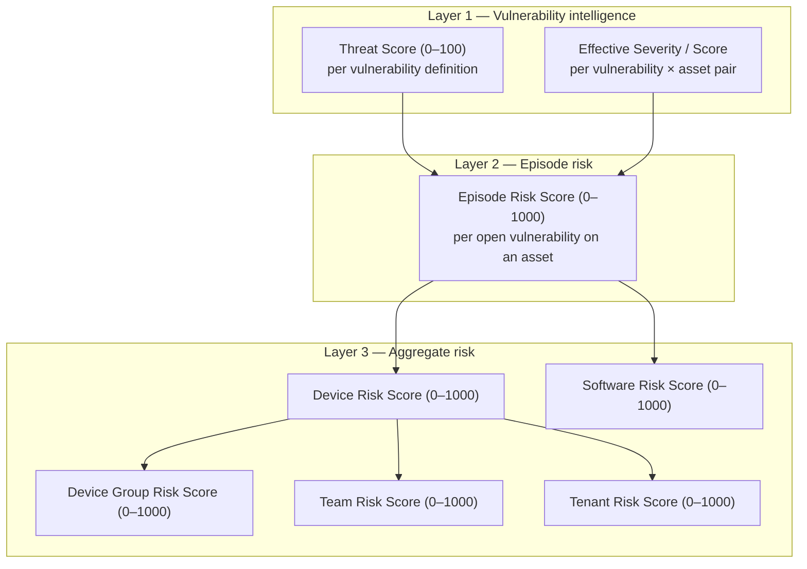
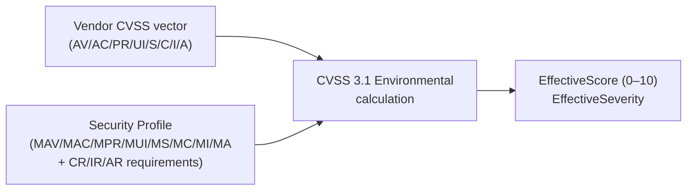
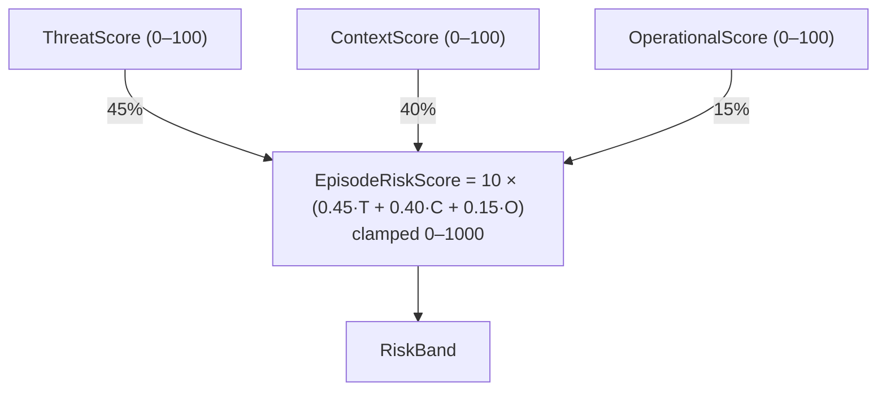
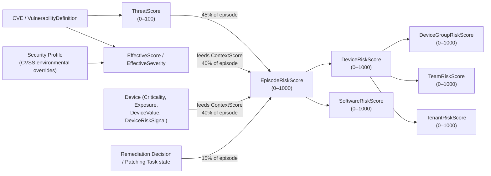

# Scoring Reference

All scores in PatchHound use the range **0–100** for sub-scores and **0–1000** for composite risk scores. Every number in this document comes directly from the scoring service implementations.

---

## Overview

The scoring system has three layers that feed into each other bottom-up:



---

## Layer 1a — Threat Score

**Source:** `VulnerabilityThreatAssessmentService`  
**Scope:** One record per `VulnerabilityDefinition` (global, not per tenant).

The Threat Score expresses how dangerous a vulnerability is in isolation — independent of where it is installed.

### Sub-scores

| Sub-score | Weight | What it measures |
|---|---|---|
| Technical | 35% | CVSS severity and base score |
| Exploit Likelihood | 25% | Known exploits, public exploits, ransomware, EPSS |
| Threat Activity | 25% | Active alerts, malware/ransomware associations |
| Recency | 15% | How recently the CVE was published |

### Technical Score

```
If CVSS score present:  TechnicalScore = CVSS × 10       (clamped 0–100)
Otherwise:
  Critical → 95,  High → 75,  Medium → 50,  Low → 25
```

### Exploit Likelihood Score

```
+60  if KnownExploited (KEV tag, "exploit verified", "exploit in kit")
+30  if PublicExploit (any "exploit" tag)
+10  if RansomwareAssociation
+0–20  EPSS score × 20  (clamped to 20)
→ clamped to 0–100
```

### Threat Activity Score

```
+40  if ActiveAlert
+30  if RansomwareAssociation
+20  if MalwareAssociation
+10  if KnownExploited
→ clamped to 0–100
```

### Recency Score

| CVE age | Score |
|---|---|
| ≤ 30 days | 80 |
| ≤ 90 days | 60 |
| ≤ 180 days | 40 |
| > 180 days | 20 |
| Unknown | 20 |

### Final Threat Score formula

```
ThreatScore = (0.35 × Technical)
            + (0.25 × ExploitLikelihood)
            + (0.25 × ThreatActivity)
            + (0.15 × Recency)
```

---

## Layer 1b — Effective Severity

**Source:** `EnvironmentalSeverityCalculator`  
**Scope:** One record per `VulnerabilityDefinition` × `Asset` pair.

When an asset has a **Security Profile** assigned, the vendor CVSS vector is re-evaluated using the profile's environmental overrides (modified attack vector, modified impact metrics, CIA requirements). The result is an `EffectiveScore` (0–10) and `EffectiveSeverity` that may be higher or lower than the vendor baseline.



If no Security Profile is assigned, `EffectiveScore` = vendor CVSS score and `EffectiveSeverity` = vendor severity.

### Severity bands (CVSS)

| Score | Severity |
|---|---|
| ≥ 9.0 | Critical |
| ≥ 7.0 | High |
| ≥ 4.0 | Medium |
| < 4.0 | Low |

---

## Layer 2 — Episode Risk Score

**Source:** `VulnerabilityEpisodeRiskAssessmentService`  
**Scope:** One record per open `VulnerabilityAssetEpisode`.

This is the core per-instance risk score. It combines threat intelligence, asset context, and operational status.



### Threat component (ThreatScore)

Uses `VulnerabilityThreatAssessment.ThreatScore` directly (see Layer 1a).  
Fallback chain if no threat assessment exists:
1. `VulnerabilityAssetAssessment.EffectiveScore × 10`
2. `VulnerabilityDefinition.CvssScore × 10`
3. Severity lookup: Critical→95, High→75, Medium→50, Low→25

### Context component (ContextScore)

Measures how attractive and exposed the specific asset is.

```
AssetCriticality:   Critical→100, High→80, Medium→55, Low→30
DeviceValue:        High→100, Normal→60, Low→30
ExposureLevel:      High→100, Medium→70, Low→40, Unknown→50
DeviceRiskScore:    High→95, Medium→65, Low→35, Unknown→50

EffectiveSeverity from VulnerabilityAssetAssessment:
  If EffectiveScore present: EffectiveScore × 10
  Else: Critical→95, High→75, Medium→50, Low→25

ContextScore = (0.35 × avg(AssetCriticality, DeviceValue))
             + (0.25 × EffectiveSeverityScore)
             + (0.20 × ExposureLevel)
             + (0.20 × DeviceRiskScore)
clamped 0–100
```

### Operational component (OperationalScore)

Measures the urgency introduced by remediation workflow state. Starts at **40**, then adjustments are applied:

```
Base:  40

+15  if asset has no owner (no OwnerUserId, OwnerTeamId, or FallbackTeamId)

With a RemediationDecision present:
  PendingApproval:       +10
  RiskAcceptance:        −20
  AlternateMitigation:    +0
  ApprovedForPatching:   +10 (no task), +10 (Pending task), +5 (InProgress task), +0 (Completed)
  PatchingDeferred:      +15
  ApprovedForPatching + overdue task: additional +20

Without a RemediationDecision:
  +10 (no decision at all)
  −20 if a legacy RiskAcceptance exists

clamped 0–100
```

### Risk Band thresholds

| EpisodeRiskScore | RiskBand |
|---|---|
| ≥ 900 | Critical |
| ≥ 750 | High |
| ≥ 500 | Medium |
| > 0 | Low |
| 0 | None |

---

## Layer 3 — Aggregate Risk Scores

All aggregate scores follow the same structural pattern: **max score + top-N average + capped count bonuses**, clamped to 0–1000.

### Device Risk Score

**Source:** `RiskScoreService.BuildAssetRiskResults`  
**Input:** All unresolved `EpisodeRiskScore` values for the device.

```
MaxEpisodeRisk   = highest single episode score
TopThreeAverage  = average of top-3 episode scores

DeviceRiskScore =  0.70 × MaxEpisodeRisk
                +  0.20 × TopThreeAverage
                +  min(CriticalCount × 35, 120)
                +  min(HighCount    × 15,  60)
                +  min(MediumCount  ×  5,  20)
                +  min(LowCount     ×  1,   5)
clamped 0–1000
```

### Software Risk Score

**Source:** `RiskScoreService.CalculateSoftwareScoresAsync`  
**Input:** Episode risk scores for all device episodes linked to a `TenantSoftware`.

```
SoftwareRiskScore =  0.65 × MaxEpisodeRisk
                  +  0.20 × TopThreeAverage
                  +  min(CriticalCount × 30, 120)
                  +  min(HighCount     × 12,  48)
                  +  min(MediumCount   ×  4,  16)
                  +  min(LowCount      ×  1,   6)
clamped 0–1000
```

### Device Group Risk Score

**Source:** `RiskScoreService.CalculateDeviceGroupScoresAsync`  
**Input:** Device Risk Scores of all devices in the group.

```
MaxAssetRisk     = highest DeviceRiskScore in the group
TopThreeAverage  = average of top-3 DeviceRiskScores

DeviceGroupRiskScore =  0.55 × MaxAssetRisk
                     +  0.25 × TopThreeAverage
                     +  min(CriticalCount × 8,  120)
                     +  min(HighCount     × 3,   60)
                     +  min(MediumCount   × 1,   20)
                     +  min(LowCount      × 0.25,  8)
clamped 0–1000
```

*Note: counts here are summed episode counts across all devices in the group.*

### Team Risk Score

**Source:** `RiskScoreService.CalculateTeamScoresAsync`  
**Input:** Device Risk Scores of all devices owned (or fallback-owned) by the team.

```
TeamRiskScore =  0.60 × MaxAssetRisk
             +   0.25 × TopThreeAverage
             +   min(CriticalCount × 10, 150)
             +   min(HighCount     ×  4,  72)
             +   min(MediumCount   ×  1,  20)
             +   min(LowCount      × 0.25,  8)
clamped 0–1000
```

### Tenant Risk Score

**Source:** `RiskScoreService.CalculateTenantRisk`  
**Input:** All Device Risk Scores for the tenant.

```
TopFiveAverage   = average of top-5 DeviceRiskScores
CriticalAssets   = devices with score ≥ 900
HighAssets       = devices with score 750–899
MediumAssets     = devices with score 500–749
LowAssets        = devices with score 1–499

TenantRiskScore =  0.55 × MaxAssetRisk
               +   0.30 × TopFiveAverage
               +   min(CriticalAssets × 18, 90)
               +   min(HighAssets     ×  8, 40)
               +   min(MediumAssets   ×  2, 10)
               +   min(LowAssets      × 0.5, 5)
clamped 0–1000
```

### Asset risk bands (used for tenant-level asset counting)

| DeviceRiskScore | Band |
|---|---|
| ≥ 900 | Critical |
| 750–899 | High |
| 500–749 | Medium |
| 1–499 | Low |

---

## How the scores relate



### Key relationships

- **ThreatScore feeds EpisodeRiskScore** at 45% weight. It is the single largest driver of episode risk.
- **EffectiveScore (via Security Profile) feeds both ContextScore and ThreatScore fallback.** A Security Profile can raise or lower the effective CVSS score for a specific environment, which flows into both the Context sub-score (25% weight inside ContextScore) and as the fallback ThreatScore when no threat assessment exists.
- **DeviceRiskScore is a rollup of EpisodeRiskScores.** It does not re-enter the episode calculation — it is a one-way aggregation.
- **All group/team/tenant scores aggregate from DeviceRiskScores**, not directly from episodes. They inherit the episode band counts (Critical/High/Medium/Low) as bonus multipliers.
- **Operational state (Remediation Decisions, Patching Tasks) only affects the episode layer** (15% weight). It does not directly modify any aggregate score — but resolving episodes (setting `ResolvedAt`) removes them from all aggregate calculations entirely.

---

## What triggers recalculation

| Event | Scores recalculated |
|---|---|
| Ingestion / vulnerability scan processed | Episode risk for affected assets |
| Remediation Decision created or approved | Episode risk for affected software/assets |
| Patching Task status changed | Episode risk for affected software/assets |
| Risk Acceptance approved | Episode risk for affected assets |
| Security Profile updated | Effective Severity for all linked assets → Episode risk |
| `RiskRefreshService.RefreshForAssetsAsync` called | Device, Group, Team, Tenant risk |
| `RiskScoreService.RecalculateForTenantAsync` called | All Layer 3 scores for the tenant + daily snapshot |

Daily snapshots of the Tenant Risk Score are retained for 30 days.
