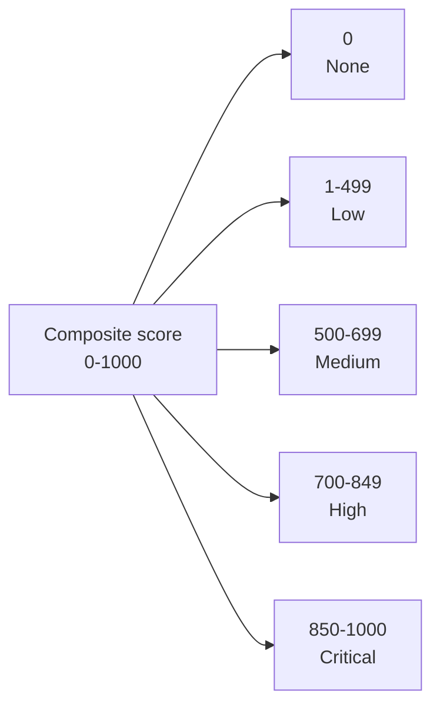
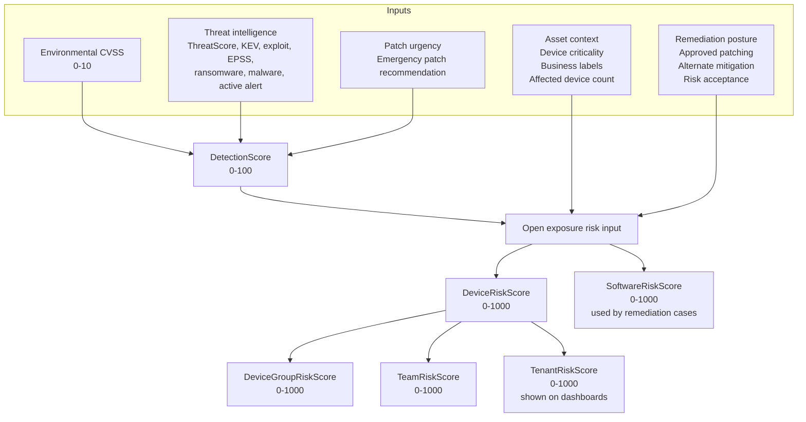
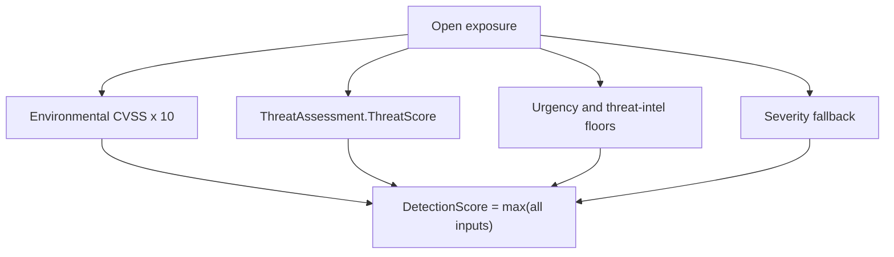
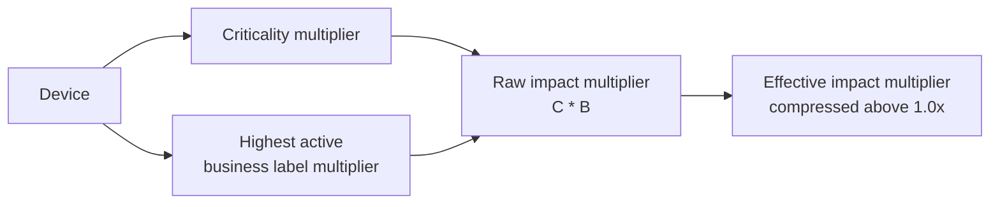
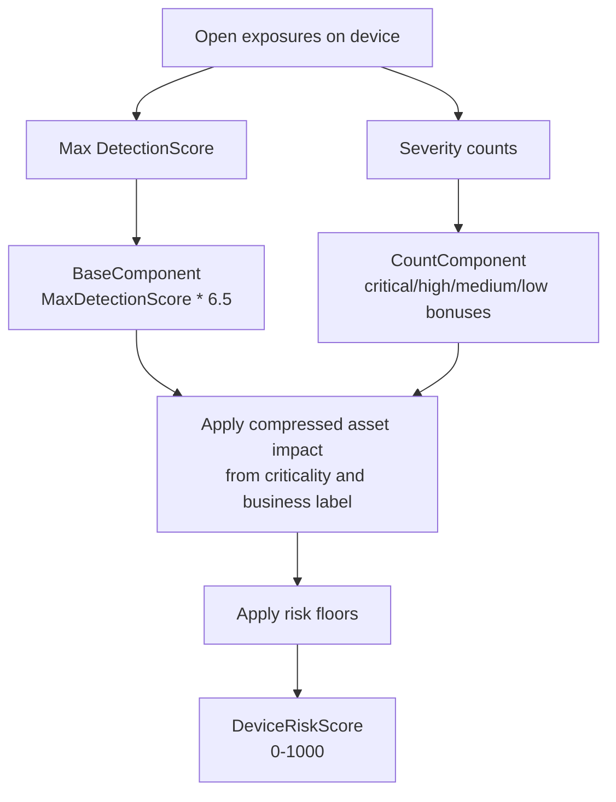
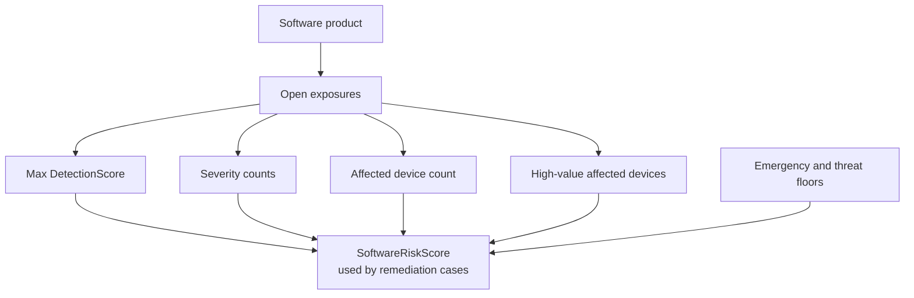
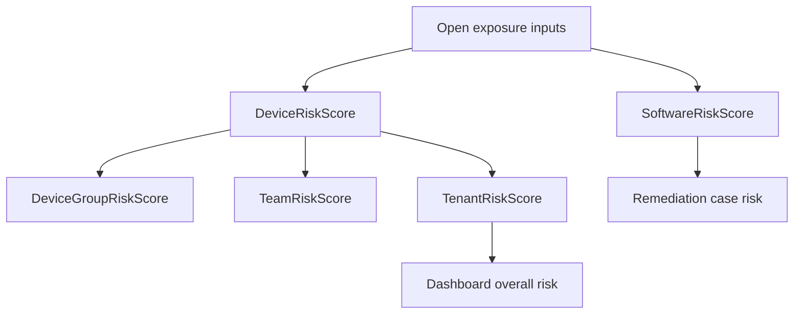
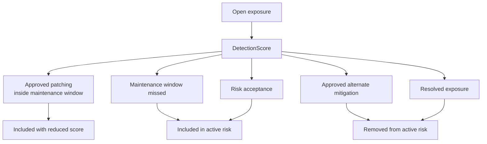

# Scoring Reference

PatchHound risk scoring uses two ranges:

- **0-100** for vulnerability-level likelihood and detection-style sub-scores.
- **0-1000** for displayed composite risk scores in dashboards, devices, software, remediation cases, teams, and tenant views.

This document describes the **TruRisk-inspired v2 scoring model**. The goal is simple: a low fleet footprint can reduce business risk, but it must not hide emergency vulnerability urgency.

---

## Risk Bands

All user-facing risk bands should use the same thresholds.

| Score | Band |
|---:|---|
| 850-1000 | Critical |
| 700-849.99 | High |
| 500-699.99 | Medium |
| 1-499.99 | Low |
| 0 | None |



---

## Big Picture

The v2 model follows the same idea as risk-based vulnerability management tools such as Qualys TruRisk:

```text
Risk = likelihood x impact
```

PatchHound calculates likelihood per open exposure, then rolls it up through the asset, software, team, and tenant views.



---

## Step 1 - Detection Score

Each open device-vulnerability exposure gets a **DetectionScore** from `0-100`.

The score starts with the best available vulnerability signal:

```text
DetectionScore = max(
  EnvironmentalCvss * 10,
  ThreatAssessment.ThreatScore,
  urgencyFloor,
  threatIntelFloor,
  severityFallback
)
```

### Floors

Floors prevent important real-world signals from being averaged away.

| Signal | DetectionScore floor |
|---|---:|
| Emergency patch recommended | 95 |
| Known exploited, active alert, ransomware, or malware association | 95 |
| Public exploit | 80 |
| EPSS >= 0.50 | 80 |
| Critical severity with no stronger signal | 90 |
| High severity with no stronger signal | 70 |
| Medium severity with no stronger signal | 40 |
| Low severity with no stronger signal | 10 |



### Example

| Input | Value |
|---|---:|
| Environmental CVSS | 8.1 |
| ThreatScore | 72 |
| Public exploit | yes |
| Emergency patch | no |

```text
Environmental signal = 8.1 * 10 = 81
Threat signal        = 72
Public exploit floor = 80

DetectionScore = max(81, 72, 80) = 81
```

If the same vulnerability has an emergency patch recommendation:

```text
Emergency floor = 95

DetectionScore = max(81, 72, 80, 95) = 95
```

---

## Step 2 - Asset Impact

Asset impact answers: "How important is the affected device?"

PatchHound uses the device `Criticality` and active business labels.

### Device Criticality Multiplier

| Device criticality | Multiplier |
|---|---:|
| Critical | 1.35 |
| High | 1.20 |
| Medium | 1.00 |
| Low | 0.85 |

### Business Label Multiplier

When a device has multiple active labels, the highest active label weight wins.

| Business label weight category | Multiplier |
|---|---:|
| Critical | 2.00 |
| Sensitive | 1.50 |
| Normal | 1.00 |
| Informational | 0.50 |



---

## Step 3 - Device Risk Score

The device score is based on all open exposures on that device.

```text
BaseComponent      = MaxDetectionScore * 6.5
CountComponent     = CriticalCount * 45
                   + HighCount     * 12
                   + MediumCount   * 3
                   + LowCount      * 1

RawDeviceScore     = BaseComponent + CountComponent

RawImpactMultiplier = DeviceCriticalityMultiplier
                    * BusinessLabelMultiplier

EffectiveImpactMultiplier =
  if RawImpactMultiplier <= 1.0:
      RawImpactMultiplier
  else:
      min(1.0 + ((RawImpactMultiplier - 1.0) * 0.35), 1.6)

DeviceRiskScore    = RawDeviceScore * EffectiveImpactMultiplier

Final score is clamped to 0-1000.
```

Why this compression exists: device criticality and business labels should increase prioritization, but they should not turn a small number of non-urgent exposures into a perfect `1000` score by themselves. Reducing labels, such as `Informational`, still reduce the score directly.

Risk floors are applied after the numeric score:

| Condition | Minimum device score |
|---|---:|
| Any emergency, known exploited, active alert, ransomware, or malware exposure | 700 |
| Any critical exposure | 500 |
| 10 or more high exposures | 500 |



### Example - Sparse High/Medium Exposure On A Valuable Device

Input:

| Signal | Value |
|---|---:|
| Highest Environmental CVSS | 7.5 |
| High exposures | 1 |
| Medium exposures | 1 |
| Device criticality | Critical, multiplier 1.35 |
| Business label | Sensitive, multiplier 1.50 |

Calculation:

```text
MaxDetectionScore       = 75
BaseComponent           = 75 * 6.5 = 487.5
CountComponent          = 1 high * 12 + 1 medium * 3 = 15
RawDeviceScore          = 487.5 + 15 = 502.5

RawImpactMultiplier     = 1.35 * 1.50 = 2.025
EffectiveImpactMultiplier
                         = 1.0 + ((2.025 - 1.0) * 0.35)
                         = 1.35875

DeviceRiskScore         = 502.5 * 1.35875 = 682.8
Band                    = Medium
```

### Example - One Emergency Critical On A High-Value Device

Input:

| Signal | Value |
|---|---:|
| DetectionScore | 95 |
| Critical exposures | 1 |
| High exposures | 0 |
| Device criticality | High, multiplier 1.20 |
| Business label | Normal, multiplier 1.00 |

Calculation:

```text
BaseComponent  = 95 * 6.5 = 617.5
CountComponent = 1 * 45 = 45
Raw score      = 617.5 + 45 = 662.5
Raw impact multiplier = 1.20 * 1.00 = 1.20
Effective multiplier  = 1.0 + ((1.20 - 1.0) * 0.35) = 1.07
Impact score   = 662.5 * 1.07 = 708.9

Emergency floor = at least 700
Final score     = max(708.9, 700) = 708.9
Band            = High
```

The old model could make this look low because CVSS-scale values were too small for a 0-1000 band. The v2 model keeps the score in the right range.

---

## Step 4 - Software Risk Score

The software score is used by software pages and remediation cases. It asks: "How risky is this software product for this tenant right now?"

Inputs:

- All open exposures linked to the software product.
- Number of affected devices.
- Number of affected high-value devices.
- Detection scores and severity counts.
- Emergency and threat-intel floors.

```text
BaseComponent       = MaxDetectionScore * 6.5
CountComponent      = CriticalCount * 45
                    + HighCount     * 12
                    + MediumCount   * 3
                    + LowCount      * 1

BreadthComponent    = 0 when only 1 device is affected
                    = min(log10(AffectedDeviceCount) * 80, 180)

HighValueComponent  = HighValueDeviceCount * 25

SoftwareRiskScore   = BaseComponent
                    + CountComponent
                    + BreadthComponent
                    + HighValueComponent

Final score is clamped to 0-1000.
```

Risk floors:

| Condition | Minimum software score |
|---|---:|
| Any emergency, known exploited, active alert, ransomware, or malware exposure | 700 |
| Any critical exposure | 500 |
| 10 or more high exposures | 500 |



### Example - The Reported Case

Scenario:

- One affected device.
- 60 open vulnerabilities.
- 1 critical vulnerability with emergency patch recommended.
- 49 high vulnerabilities.
- 10 medium/low vulnerabilities omitted from this example for simplicity.

Assumptions:

- Emergency critical vulnerability has `DetectionScore = 95`.
- High vulnerabilities have `DetectionScore >= 70`.
- One affected device means no breadth bonus.
- The device is not high-value, so no high-value bonus.

Calculation:

```text
MaxDetectionScore = 95
CriticalCount     = 1
HighCount         = 49
AffectedDevices   = 1
HighValueDevices  = 0

BaseComponent      = 95 * 6.5 = 617.5
CountComponent     = (1 * 45) + (49 * 12)
                   = 45 + 588
                   = 633
BreadthComponent   = 0
HighValueComponent = 0

Raw score          = 617.5 + 633 = 1250.5
Clamped score      = 1000
Emergency floor    = at least 700
Final score        = 1000
Band               = Critical
```

If the same case had only the single emergency critical vulnerability and no other findings:

```text
BaseComponent      = 95 * 6.5 = 617.5
CountComponent     = 1 * 45 = 45
Raw score          = 662.5
Emergency floor    = at least 700
Final score        = 700
Band               = High
```

So yes, one affected device reduces fleet exposure. It does **not** reduce emergency urgency below High.

### Example - Broad High Severity Without Emergency

Scenario:

- 20 affected devices.
- 12 high vulnerabilities.
- MaxDetectionScore = 75.
- 4 high-value devices.

```text
BaseComponent       = 75 * 6.5 = 487.5
CountComponent      = 12 * 12 = 144
BreadthComponent    = log10(20) * 80 = 104.08
HighValueComponent  = 4 * 25 = 100

Raw score           = 487.5 + 144 + 104.08 + 100 = 835.58
Final score         = 835.58
Band                = High
```

---

## Step 5 - Rollup Scores

Rollups are based on the scores beneath them. They do not re-score vulnerabilities from scratch.



### Device Group Risk

```text
DeviceGroupRiskScore =
    0.55 * MaxDeviceRiskScore
  + 0.25 * AverageTopThreeDeviceRiskScores
  + min(CriticalEpisodeCount * 8, 120)
  + min(HighEpisodeCount     * 3, 60)
  + min(MediumEpisodeCount   * 1, 20)
  + min(LowEpisodeCount      * 0.25, 8)
```

### Team Risk

```text
TeamRiskScore =
    0.60 * MaxDeviceRiskScore
  + 0.25 * AverageTopThreeDeviceRiskScores
  + min(CriticalEpisodeCount * 10, 150)
  + min(HighEpisodeCount     * 4, 72)
  + min(MediumEpisodeCount   * 1, 20)
  + min(LowEpisodeCount      * 0.25, 8)
```

### Tenant Risk

The tenant/dashboard score asks: "How risky is the tenant overall?"

```text
TenantRiskScore =
    0.55 * MaxDeviceRiskScore
  + 0.30 * AverageTopFiveDeviceRiskScores
  + min(CriticalAssetCount * 18, 90)
  + min(HighAssetCount     * 8, 40)
  + min(MediumAssetCount   * 2, 10)
  + min(LowAssetCount      * 0.5, 5)
```

Asset band counts use the shared thresholds:

| Device score | Asset count bucket |
|---:|---|
| >= 850 | CriticalAssetCount |
| 700-849.99 | HighAssetCount |
| 500-699.99 | MediumAssetCount |
| 1-499.99 | LowAssetCount |

### Example - Dashboard Overall Risk

Assume a tenant has these top device scores:

| Device | Score | Band |
|---|---:|---|
| Device A | 708.9 | High |
| Device B | 620 | Medium |
| Device C | 520 | Medium |
| Device D | 120 | Low |
| Device E | 0 | None |

```text
MaxDeviceRiskScore          = 708.9
AverageTopFiveDeviceScores  = (708.9 + 620 + 520 + 120 + 0) / 5
                             = 393.78

CriticalAssetCount = 0
HighAssetCount     = 1
MediumAssetCount   = 2
LowAssetCount      = 1

TenantRiskScore =
    0.55 * 708.9
  + 0.30 * 393.78
  + min(0 * 18, 90)
  + min(1 * 8, 40)
  + min(2 * 2, 10)
  + min(1 * 0.5, 5)

= 389.90 + 118.13 + 0 + 8 + 4 + 0.5
= 520.53

Band = Medium
```

This is intentionally lower than the highest individual device score because the dashboard is a tenant-level exposure score. However, it is no longer artificially tiny when the top devices contain real high-risk exposures.

---

## Remediation Effects

Remediation posture changes the inputs before rollup.

| Remediation state | Scoring behavior |
|---|---|
| Approved for patching, maintenance window not missed | The exposure's Environmental CVSS input is reduced by the remediation adjustment factor while work is on track. ThreatScore and exploit/urgency floors still apply. |
| Approved for patching, maintenance window missed | No reduction |
| Risk acceptance | Visibility only; no score reduction |
| Alternate mitigation approved | Covered vulnerabilities are removed from active risk |
| Exposure resolved | Exposure is removed from device, software, team, group, and tenant rollups |



---

## What Triggers Recalculation

| Event | Scores recalculated |
|---|---|
| Ingestion or vulnerability scan processed | Exposure inputs, device/software scores, rollups |
| Threat intelligence refreshed | Detection scores and all affected rollups |
| Vulnerability patch assessment created or updated | Detection floors and all affected rollups |
| Security profile updated | Environmental CVSS and all affected rollups |
| Device criticality or business labels changed | Device score and rollups |
| Remediation decision approved | Affected device/software scores and rollups |
| Patching task status or maintenance window changes | Affected device/software scores and rollups |
| Exposure resolved | Exposure removed from active rollups |
| `RiskScoreService.RecalculateForTenantAsync` called | All tenant Layer 3 scores and daily snapshot |

Daily tenant risk snapshots are retained for trend views. After a scoring-version change, existing tenants need recalculation so stored scores move from the old calculation version to the new one.

---

## Design Principles

- **Emergency urgency cannot be hidden by small affected-device count.**
- **One affected device still matters less than broad tenant exposure.**
- **Threat intelligence can raise risk above CVSS-only severity.**
- **Critical business assets increase impact.**
- **Risk acceptance is not remediation and does not reduce risk.**
- **Approved alternate mitigation and resolved exposures reduce active risk because they remove exposure from the active set.**
