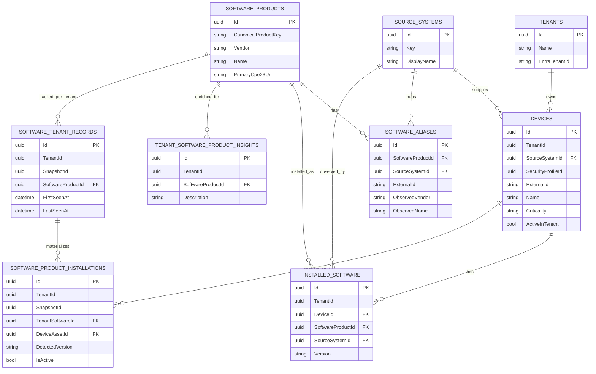
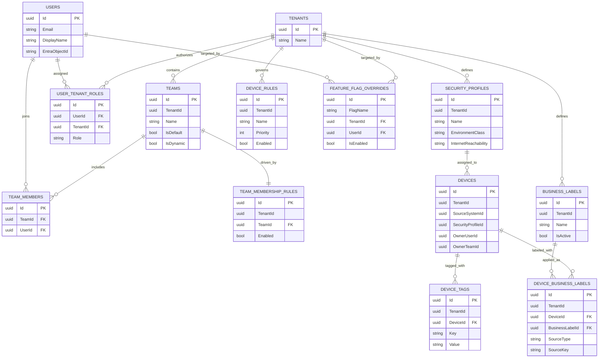

# Database Diagram

This document captures the current PatchHound database model as Mermaid ER diagrams.

Source of truth:
- `src/PatchHound.Infrastructure/Migrations/20260415055843_Initial.cs`
- `src/PatchHound.Infrastructure/Migrations/PatchHoundDbContextModelSnapshot.cs`
- `docs/data-model-refactor.md`

The schema is large, so the diagram is split by domain to stay readable.

## Core inventory and identity

## Device policy, ownership, and tenant access

## Vulnerability knowledge, exposure, and remediation

```mermaid
erDiagram
    SOFTWARE_PRODUCTS {
        uuid Id PK
        string CanonicalProductKey
        string Vendor
        string Name
    }

    VULNERABILITIES {
        uuid Id PK
        string Source
        string ExternalId
        string Title
        decimal CvssScore
    }

    VULNERABILITY_REFERENCES {
        uuid Id PK
        uuid VulnerabilityId FK
        string Url
        string Source
    }

    THREAT_ASSESSMENTS {
        uuid Id PK
        uuid VulnerabilityId FK
        decimal ThreatScore
        bool KnownExploited
    }

    VULNERABILITY_APPLICABILITIES {
        uuid Id PK
        uuid VulnerabilityId FK
        uuid SoftwareProductId FK
        string CpeCriteria
        bool Vulnerable
    }

    ORGANIZATIONAL_SEVERITIES {
        uuid Id PK
        uuid TenantId
        uuid VulnerabilityId FK
        string AdjustedSeverity
    }

    DEVICES {
        uuid Id PK
        uuid TenantId
        string Name
    }

    INSTALLED_SOFTWARE {
        uuid Id PK
        uuid TenantId
        uuid DeviceId FK
        uuid SoftwareProductId FK
    }

    SECURITY_PROFILES {
        uuid Id PK
        uuid TenantId
        string Name
    }

    DEVICE_VULNERABILITY_EXPOSURES {
        uuid Id PK
        uuid TenantId
        uuid DeviceId FK
        uuid VulnerabilityId FK
        uuid SoftwareProductId FK
        uuid InstalledSoftwareId FK
        string Status
    }

    EXPOSURE_EPISODES {
        uuid Id PK
        uuid TenantId
        uuid DeviceVulnerabilityExposureId FK
        int EpisodeNumber
        datetime ClosedAt
    }

    EXPOSURE_ASSESSMENTS {
        uuid Id PK
        uuid TenantId
        uuid DeviceVulnerabilityExposureId FK
        uuid SecurityProfileId FK
        decimal BaseCvss
        decimal EnvironmentalCvss
    }

    REMEDIATION_CASES {
        uuid Id PK
        uuid TenantId
        uuid SoftwareProductId FK
        string Status
    }

    REMEDIATION_WORKFLOWS {
        uuid Id PK
        uuid TenantId
        uuid RemediationCaseId FK
        uuid SoftwareOwnerTeamId
        string CurrentStage
        string Status
    }

    REMEDIATION_DECISIONS {
        uuid Id PK
        uuid TenantId
        uuid RemediationCaseId FK
        uuid RemediationWorkflowId FK
        string Outcome
        string ApprovalStatus
    }

    REMEDIATION_DECISION_VULNERABILITY_OVERRIDES {
        uuid Id PK
        uuid RemediationDecisionId FK
        uuid VulnerabilityId FK
        string Outcome
    }

    APPROVAL_TASKS {
        uuid Id PK
        uuid TenantId
        uuid RemediationCaseId FK
        uuid RemediationWorkflowId FK
        uuid RemediationDecisionId FK
        string Status
        datetime ExpiresAt
    }

    APPROVAL_TASK_VISIBLE_ROLES {
        uuid Id PK
        uuid ApprovalTaskId FK
        string Role
    }

    PATCHING_TASKS {
        uuid Id PK
        uuid TenantId
        uuid RemediationCaseId FK
        uuid RemediationWorkflowId FK
        uuid RemediationDecisionId FK
        uuid OwnerTeamId
        string Status
    }

    RISK_ACCEPTANCES {
        uuid Id PK
        uuid TenantId
        uuid RemediationCaseId FK
        uuid VulnerabilityId
        string Status
    }

    ANALYST_RECOMMENDATIONS {
        uuid Id PK
        uuid TenantId
        uuid RemediationCaseId FK
        uuid RemediationWorkflowId FK
        uuid VulnerabilityId
        string RecommendedOutcome
    }

    AI_REPORTS {
        uuid Id PK
        uuid TenantId
        uuid RemediationCaseId FK
        uuid VulnerabilityId FK
        uuid TenantAiProfileId FK
    }

    SOFTWARE_DESCRIPTION_JOBS {
        uuid Id PK
        uuid TenantId
        uuid SoftwareProductId
        uuid TenantAiProfileId
        string Status
    }

    REMEDIATION_AI_JOBS {
        uuid Id PK
        uuid TenantId
        uuid RemediationCaseId
        string Status
    }

    SOFTWARE_PRODUCTS ||--o{ VULNERABILITY_APPLICABILITIES : affected_product
    VULNERABILITIES ||--o{ VULNERABILITY_REFERENCES : documented_by
    VULNERABILITIES ||--|| THREAT_ASSESSMENTS : scored_by
    VULNERABILITIES ||--o{ VULNERABILITY_APPLICABILITIES : applies_to
    VULNERABILITIES ||--o{ ORGANIZATIONAL_SEVERITIES : adjusted_per_tenant
    DEVICES ||--o{ DEVICE_VULNERABILITY_EXPOSURES : has
    INSTALLED_SOFTWARE ||--o{ DEVICE_VULNERABILITY_EXPOSURES : causes
    SOFTWARE_PRODUCTS ||--o{ DEVICE_VULNERABILITY_EXPOSURES : product_context
    VULNERABILITIES ||--o{ DEVICE_VULNERABILITY_EXPOSURES : exposes
    DEVICE_VULNERABILITY_EXPOSURES ||--o{ EXPOSURE_EPISODES : lifecycles
    DEVICE_VULNERABILITY_EXPOSURES ||--|| EXPOSURE_ASSESSMENTS : assessed_by
    SECURITY_PROFILES ||--o{ EXPOSURE_ASSESSMENTS : influences
    SOFTWARE_PRODUCTS ||--o{ REMEDIATION_CASES : remediated_through
    REMEDIATION_CASES ||--o{ REMEDIATION_WORKFLOWS : progresses_by
    REMEDIATION_CASES ||--o{ REMEDIATION_DECISIONS : decided_by
    REMEDIATION_WORKFLOWS ||--o{ REMEDIATION_DECISIONS : contextualizes
    REMEDIATION_DECISIONS ||--o{ REMEDIATION_DECISION_VULNERABILITY_OVERRIDES : overrides
    VULNERABILITIES ||--o{ REMEDIATION_DECISION_VULNERABILITY_OVERRIDES : target
    REMEDIATION_CASES ||--o{ APPROVAL_TASKS : requires
    REMEDIATION_DECISIONS ||--o{ APPROVAL_TASKS : gated_by
    REMEDIATION_WORKFLOWS ||--o{ APPROVAL_TASKS : spawned_in
    APPROVAL_TASKS ||--o{ APPROVAL_TASK_VISIBLE_ROLES : visible_to
    REMEDIATION_CASES ||--o{ PATCHING_TASKS : executes
    REMEDIATION_DECISIONS ||--o{ PATCHING_TASKS : drives
    REMEDIATION_WORKFLOWS ||--o{ PATCHING_TASKS : scheduled_in
    REMEDIATION_CASES ||--o{ RISK_ACCEPTANCES : exception_path
    REMEDIATION_CASES ||--o{ ANALYST_RECOMMENDATIONS : analyzed_by
    REMEDIATION_WORKFLOWS ||--o{ ANALYST_RECOMMENDATIONS : optional_context
    REMEDIATION_CASES ||--o{ AI_REPORTS : explained_by
```

## Ingestion, authenticated scans, and workflows

```mermaid
erDiagram
    TENANTS {
        uuid Id PK
        string Name
    }

    USERS {
        uuid Id PK
        string Email
    }

    DEVICES {
        uuid Id PK
        uuid TenantId
        string Name
    }

    INGESTION_RUNS {
        uuid Id PK
        uuid TenantId
        string SourceKey
        string Status
        datetime StartedAt
    }

    INGESTION_CHECKPOINTS {
        uuid Id PK
        uuid IngestionRunId
        uuid TenantId
        string Phase
        string Status
    }

    INGESTION_SNAPSHOTS {
        uuid Id PK
        uuid TenantId
        uuid IngestionRunId
        string SourceKey
        string Status
    }

    TENANT_SOURCE_CONFIGURATIONS {
        uuid Id PK
        uuid TenantId
        string SourceKey
        uuid ActiveIngestionRunId
        uuid ActiveSnapshotId
        uuid BuildingSnapshotId
    }

    STAGED_DEVICES {
        uuid Id PK
        uuid IngestionRunId
        uuid TenantId
        string SourceKey
        string ExternalId
    }

    STAGED_DEVICE_SOFTWARE_INSTALLATIONS {
        uuid Id PK
        uuid IngestionRunId
        uuid TenantId
        string DeviceExternalId
        string SoftwareExternalId
    }

    STAGED_VULNERABILITIES {
        uuid Id PK
        uuid IngestionRunId
        uuid TenantId
        string ExternalId
    }

    STAGED_VULNERABILITY_EXPOSURES {
        uuid Id PK
        uuid IngestionRunId
        uuid TenantId
        string VulnerabilityExternalId
        string AssetExternalId
    }

    CONNECTION_PROFILES {
        uuid Id PK
        uuid TenantId
        string Name
        string Kind
    }

    SCAN_RUNNERS {
        uuid Id PK
        uuid TenantId
        string Name
        bool Enabled
    }

    SCANNING_TOOLS {
        uuid Id PK
        uuid TenantId
        string Name
        uuid CurrentVersionId
    }

    SCANNING_TOOL_VERSIONS {
        uuid Id PK
        uuid ScanningToolId
        int VersionNumber
    }

    SCAN_PROFILES {
        uuid Id PK
        uuid TenantId
        uuid ConnectionProfileId
        uuid ScanRunnerId
        string Name
    }

    SCAN_PROFILE_TOOLS {
        uuid ScanProfileId PK
        uuid ScanningToolId PK
        int ExecutionOrder
    }

    DEVICE_SCAN_PROFILE_ASSIGNMENTS {
        uuid DeviceId PK
        uuid ScanProfileId PK
        uuid TenantId
        uuid AssignedByRuleId
    }

    AUTHENTICATED_SCAN_RUNS {
        uuid Id PK
        uuid TenantId
        uuid ScanProfileId
        uuid TriggeredByUserId
        string Status
    }

    SCAN_JOBS {
        uuid Id PK
        uuid TenantId
        uuid RunId
        uuid ScanRunnerId
        uuid DeviceId
        uuid ConnectionProfileId
        string Status
    }

    SCAN_JOB_RESULTS {
        uuid Id PK
        uuid ScanJobId
        datetime CapturedAt
    }

    SCAN_JOB_VALIDATION_ISSUES {
        uuid Id PK
        uuid ScanJobId
        string FieldPath
    }

    STAGED_DETECTED_SOFTWARE {
        uuid Id PK
        uuid TenantId
        uuid ScanJobId
        uuid DeviceId
        uuid ScanProfileId
    }

    WORKFLOW_DEFINITIONS {
        uuid Id PK
        uuid TenantId
        string Name
        string Scope
        string TriggerType
    }

    WORKFLOW_INSTANCES {
        uuid Id PK
        uuid WorkflowDefinitionId FK
        uuid TenantId
        string Status
    }

    WORKFLOW_NODE_EXECUTIONS {
        uuid Id PK
        uuid WorkflowInstanceId FK
        string NodeId
        string Status
    }

    WORKFLOW_ACTIONS {
        uuid Id PK
        uuid WorkflowInstanceId FK
        uuid NodeExecutionId FK
        uuid TenantId
        uuid TeamId
        string ActionType
        string Status
    }

    TENANTS ||--o{ INGESTION_RUNS : runs
    INGESTION_RUNS ||--o{ INGESTION_CHECKPOINTS : checkpoints
    INGESTION_RUNS ||--o{ INGESTION_SNAPSHOTS : produces
    TENANTS ||--o{ TENANT_SOURCE_CONFIGURATIONS : configures
    INGESTION_RUNS ||--o{ STAGED_DEVICES : stages
    INGESTION_RUNS ||--o{ STAGED_DEVICE_SOFTWARE_INSTALLATIONS : stages
    INGESTION_RUNS ||--o{ STAGED_VULNERABILITIES : stages
    INGESTION_RUNS ||--o{ STAGED_VULNERABILITY_EXPOSURES : stages
    SCANNING_TOOLS ||--o{ SCANNING_TOOL_VERSIONS : versions
    SCAN_PROFILES ||--o{ SCAN_PROFILE_TOOLS : uses
    SCANNING_TOOLS ||--o{ SCAN_PROFILE_TOOLS : included_in
    DEVICES ||--o{ DEVICE_SCAN_PROFILE_ASSIGNMENTS : assigned
    SCAN_PROFILES ||--o{ DEVICE_SCAN_PROFILE_ASSIGNMENTS : targets
    USERS ||--o{ AUTHENTICATED_SCAN_RUNS : triggers
    SCAN_PROFILES ||--o{ AUTHENTICATED_SCAN_RUNS : executes
    WORKFLOW_DEFINITIONS ||--o{ WORKFLOW_INSTANCES : instantiated_as
    WORKFLOW_INSTANCES ||--o{ WORKFLOW_NODE_EXECUTIONS : runs
    WORKFLOW_INSTANCES ||--o{ WORKFLOW_ACTIONS : emits
    WORKFLOW_NODE_EXECUTIONS ||--|| WORKFLOW_ACTIONS : may_create
```

## Notes

- The diagrams emphasize the canonical relationships used by the application and the explicit foreign keys present in the initial migration.
- Some operational tables store GUID references without a database foreign-key constraint. Those are still shown where they are part of an important application flow.
- Tenant scoping is a first-class model rule in this schema. Most operational tables include a direct `TenantId`, even when a parent row also implies tenant ownership.
